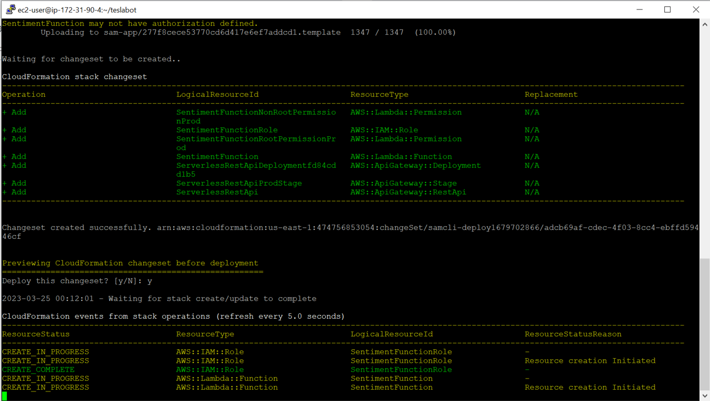
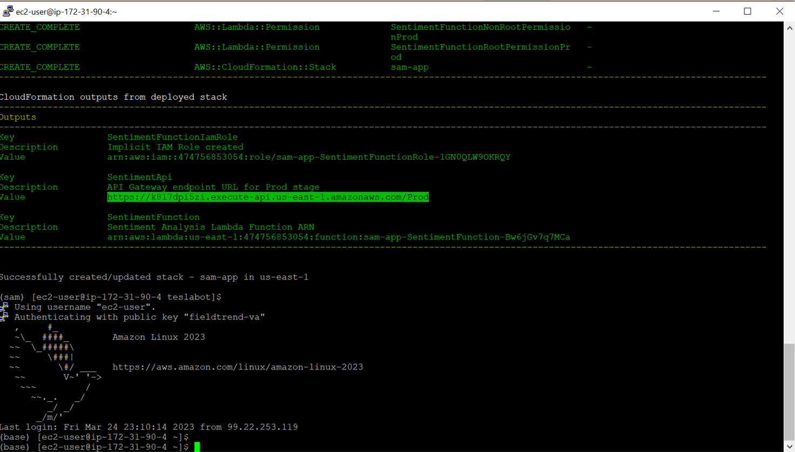
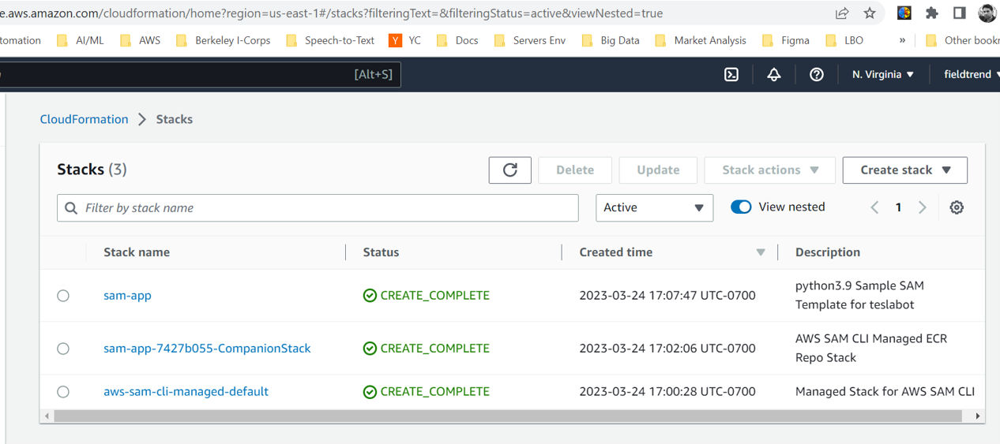

# Serverless App for Sentiment Analysis Function

## Deployment in-progress

## Deployment complete

## SAM on cloudformation

## SAM on FASTAPI

## Interview Readiness:
What are 3 advantages of deploying using Model Serving methods Vs. deploying on GitHub Pages or HuggingFace for free?  

Model serving methods offer several advantages over deploying on GitHub Pages or HuggingFace for free:

Scalability: Model serving methods such as Kubernetes or Docker allow you to easily scale your application to handle large volumes of traffic. You can deploy your application on multiple nodes to handle a high number of requests and ensure that your application remains highly available.

Customization: Model serving methods give you more control over the deployment environment. You can customize the infrastructure to meet your specific needs, such as choosing a specific operating system or configuring the network settings. This level of control is not possible when deploying on GitHub Pages or HuggingFace for free.

Security: Model serving methods offer more robust security features to protect your application and data. You can configure access controls to restrict who can access your application, use encryption to protect your data, and monitor your application for potential security threats. These security features are essential if you're dealing with sensitive data or applications that require a high level of security.

Overall, while deploying on GitHub Pages or HuggingFace for free can be a good option for small-scale applications, model serving methods offer more scalability, customization, and security for larger, more complex applications.

## Interview Readiness:
What is ML model deployment?  

Machine Learning (ML) model deployment is the process of making trained ML models available for use in a production environment. 

## Interview Readiness:
What is Causal Inference and How Does It Work?

Causal inference is a field of statistics and data analysis that aims to understand the causal relationship between variables. In other words, it seeks to determine whether a change in one variable causes a change in another variable.

## Interview Readiness:
What is serverless deployment and how its compared with deployment on server?

Serverless deployment is a method of deploying applications that allows developers to build and run applications without having to manage or provision servers. Instead of running on a dedicated server or virtual machine, serverless applications run on a managed service provided by a cloud provider such as AWS Lambda, Google Cloud Functions, or Azure Functions.

In serverless deployment, the cloud provider manages the underlying infrastructure, including the servers, operating system, and runtime environment. Developers only need to provide the code for the application, which is executed on-demand in response to user requests.

Compared to deployment on a server, serverless deployment offers several advantages, including:

Scalability: Serverless applications can scale automatically to handle increases in traffic, without requiring developers to manage the infrastructure.

Cost-effectiveness: Because serverless applications are billed only for the actual amount of resources used, they can be more cost-effective than traditional deployments on servers.

Reduced operational burden: Serverless deployment reduces the operational burden on developers, as they no longer need to manage servers, operating systems, or runtime environments.

Faster time to market: Serverless deployment allows developers to focus on writing code, rather than managing infrastructure, which can reduce time to market for new applications.

However, serverless deployment also has some limitations. For example, serverless applications may have higher latency compared to traditional deployments on servers, and they may be limited in terms of the available programming languages and runtime environments. Additionally, serverless deployments may be more difficult to troubleshoot and debug, as developers have less visibility into the underlying infrastructure.

Overall, serverless deployment offers a more streamlined and efficient approach to application deployment and management, but it may not be suitable for all applications or use cases.
